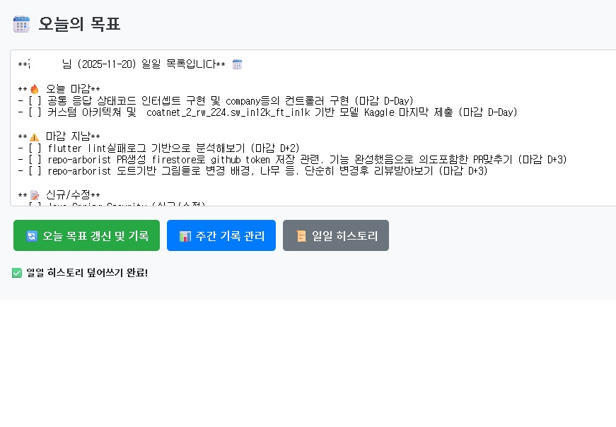
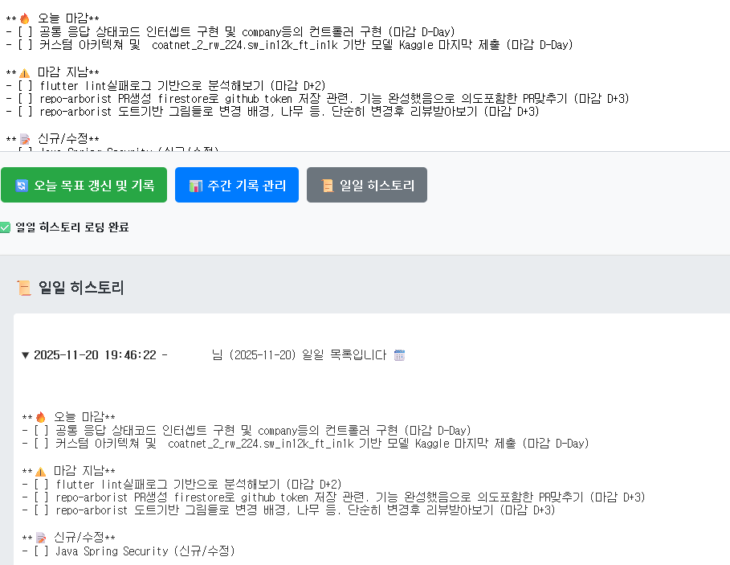
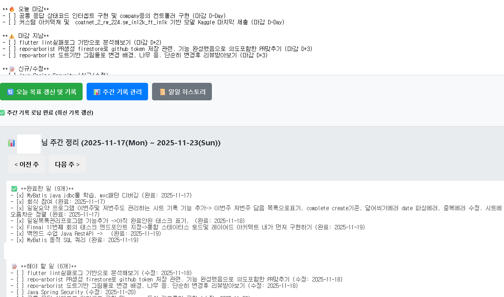

# Google Tasks Summary

Google Tasks를 활용한 일일/주간 업무 정리 웹 앱입니다. Google Tasks API를 통해 오늘의 할 일, 완료한 일, 마감 임박 항목 등을 자동으로 정리하고 Google Sheets에 히스토리를 기록합니다.

## 주요 기능



### 일일 목표 관리
- 오늘 관련 태스크를 우선순위별로 자동 분류
  - **오늘 마감 (D-Day)**: 오늘 마감인 태스크
  - **곧 마감 (D-1, D-2, D-3)**: 3일 이내 마감 예정
  - **마감 지남 (D+)**: 최근 3일 이내 마감 지난 태스크
  - **신규/수정**: 오늘 생성되거나 수정된 태스크
  - **완료**: 오늘 완료한 태스크



### 주간 정리
- 주간 단위로 완료한 일과 해야 할 일을 집계
- 이전/다음 주 기록 조회 가능
- Google Sheets에 주간 기록 자동 저장



### 히스토리 관리
- Google Sheets에 일일/주간 기록 자동 저장
- 최근 20개 일일 히스토리 조회
- 동일 날짜 기록은 자동으로 덮어쓰기

## 기술 스택

- **Google Apps Script**: 서버리스 백엔드
- **Google Tasks API**: 태스크 데이터 조회
- **Google Sheets API**: 히스토리 저장
- **HTML/CSS/JavaScript**: 프론트엔드 UI
- **Netlify**: DNS 호스팅 및 HTTPS 제공 ([커스텀 도메인 설정](docs/CUSTOM_DOMAIN.md))

## 프로젝트 구조

```
google-tasks-summary/
├── Code.js              # 메인 Apps Script 로직
├── Index.html           # 웹 UI
├── appsscript.json      # Apps Script 설정
├── deploy.js            # 자동 배포 스크립트
├── package.json         # npm 설정
├── SETUP_GUIDE.md       # 설정 가이드
├── README.md            # 프로젝트 문서
└── docs/
    └── CUSTOM_DOMAIN.md # 커스텀 도메인 설정 가이드
```

## 설치 및 설정

자세한 설정 방법은 [SETUP_GUIDE.md](SETUP_GUIDE.md)를 참고하세요.

### 빠른 시작

1. **필수 요구사항**
   - Google 계정
   - Node.js 설치
   - clasp CLI 설치: `npm install -g @google/clasp`

2. **프로젝트 설정**
   ```bash
   git clone https://github.com/murphybread/google-tasks-summary.git
   cd google-tasks-summary
   npm install
   ```

3. **Google Apps Script 연동**
   ```bash
   clasp login
   clasp clone <SCRIPT_ID>
   ```

4. **환경 변수 설정**
   - Google Apps Script 웹 에디터에서 스크립트 속성 설정
   - `TASK_LIST_NAME`: Google Tasks 목록 이름
   - `TEAM_MEMBER_NAME`: 사용자 이름
   - `SHEET_ID`: Google Sheets ID

5. **배포**
   ```bash
   npm run deploy
   ```

## 사용 방법

1. Google Apps Script 웹 앱 URL에 접속 (또는 커스텀 도메인)
2. "오늘 목표 갱신 및 기록" 버튼 클릭하여 최신 데이터 조회
3. "주간 기록 관리" 버튼으로 주간 정리 확인
4. "일일 히스토리" 버튼으로 과거 기록 조회

<!--
스크린샷 추가 예시:


-->

## npm 스크립트

- `npm run push`: 로컬 파일을 Apps Script에 푸시
- `npm run deploy`: 자동 배포 (push + 배포 생성)
- `npm run deploy:new`: 새 배포 버전 생성
- `npm run deployments`: 배포 목록 확인

## 주요 함수

### Code.js
- `doGet()`: 웹 앱 진입점
- `getTodaysTasksAndFormatMD()`: 오늘의 태스크 조회 및 마크다운 변환
- `getOrUpdateWeeklySummary(weekOffset)`: 주간 정리 조회/생성
- `recordHistory(mdContent)`: Google Sheets에 히스토리 기록
- `getHistory()`: 최근 20개 히스토리 조회

## 라이선스

ISC

## 기여

이슈 및 PR은 언제나 환영합니다!

## 문제 해결

- Google Tasks API가 활성화되지 않은 경우: Apps Script 프로젝트 설정에서 Services > Tasks API 추가
- 권한 오류: 웹 앱 배포 시 "나만 사용" 또는 "모든 사용자" 선택 확인
- Sheets 오류: `SHEET_ID`가 올바르게 설정되었는지 확인

## 저장소

- GitHub: [murphybread/google-tasks-summary](https://github.com/murphybread/google-tasks-summary)
