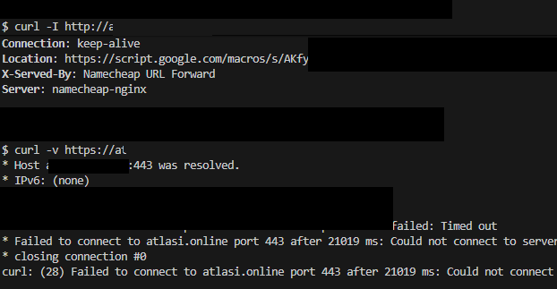
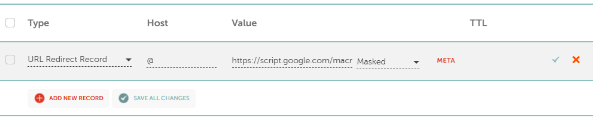
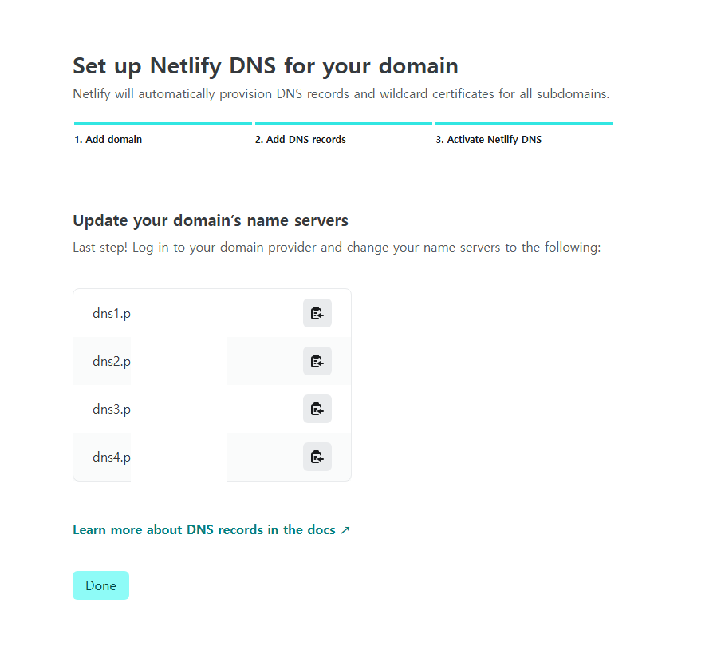
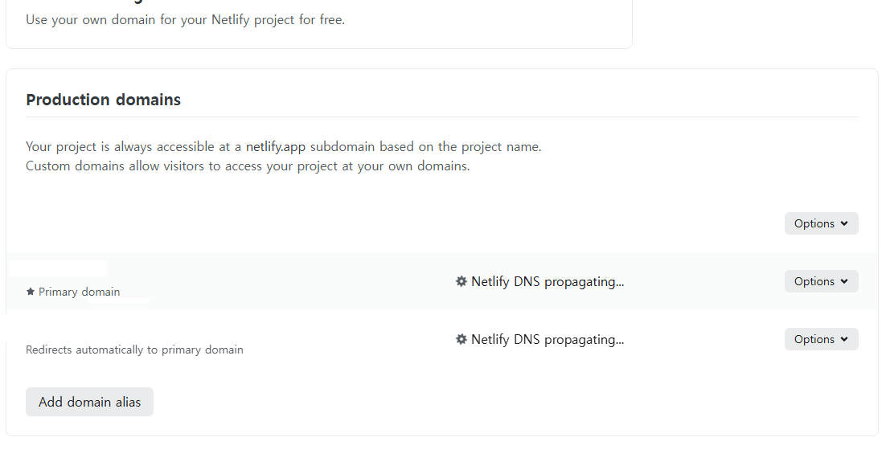
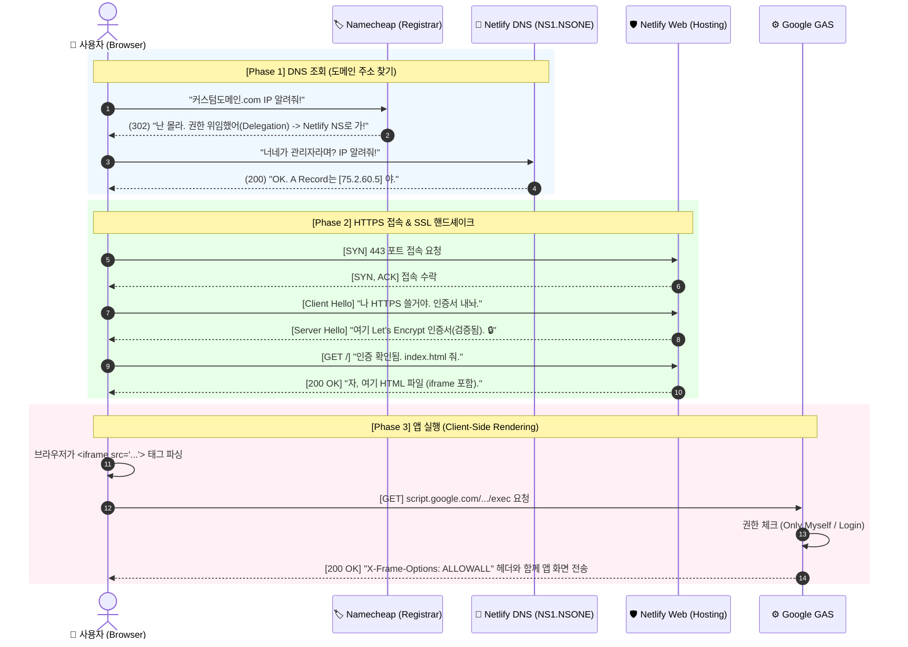
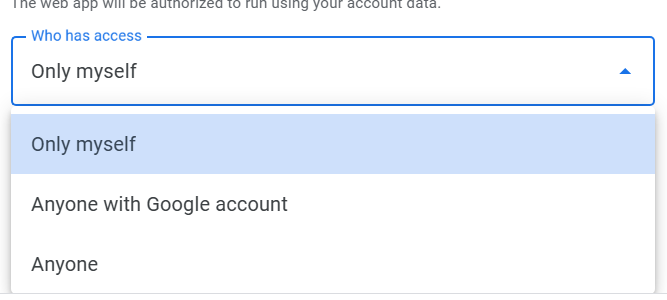
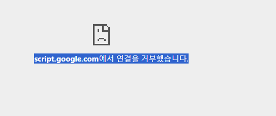
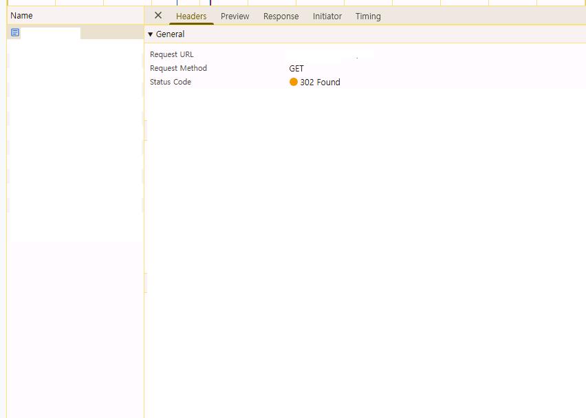

# 📑 최종 기술 보고서: Serverless GAS 커스텀 도메인 아키텍처 구축

**프로젝트:** 커스텀 도메인 (Google Apps Script Web App)

**작성일:** 2025년 11월 25일

**수신:** Murphy Kim

**목표:** 인프라 관리 비용을 최소로(Serverless)으로 HTTPS 보안이 적용된 커스텀 도메인 서비스 구축.

---

## 1. 개요 (Executive Summary)

기존 Namecheap BasicDNS의 기술적 한계(HTTPS 미지원)를 극복하기 위해, **Netlify를 DNS 및 호스팅 공급자로 도입**하였습니다. 이를 통해 **"Namecheap(도메인) - Netlify(보안/호스팅) - Google(앱 로직)"**으로 이어지는 3-Tier Serverless 아키텍처를 완성했습니다.

---

## 2. Problem Statement (WHY: 왜 기존 방식은 실패했는가?)

### 2.1. 현상

- Namecheap의 `Masked Redirect` 설정 후, `http://` 접속은 성공했으나 **`https://` 접속 시 `ERR_CONNECTION_TIMED_OUT` 발생**.


_curl 명령어로 검증한 결과: HTTP(80)는 정상 응답하지만, HTTPS(443)는 SSL 핸드셰이크 실패로 타임아웃 발생_

### 2.2. 원인 분석 (Root Cause)

- **Namecheap BasicDNS의 한계:** 무료 리다이렉트 서버는 **Port 80 (HTTP)**만 수신하며, **Port 443 (HTTPS)**에 대한 SSL 인증서를 제공하지 않음.
- **Handshake 실패:** 최신 브라우저는 HTTPS 접속을 강제하지만, 서버가 인증서(Identity)를 제시하지 못해 TCP 연결 단계에서 침묵(Drop)함.
- **공식 근거:** Namecheap Knowledgebase에 따르면, HTTPS 리다이렉트는 **"SSL 인증서가 설치된 cPanel(유료 호스팅)"** 환경에서만 지원됨.


_Namecheap의 URL Redirect(Masked) 설정 화면. BasicDNS는 구조적으로 SSL 인증서를 제공하지 않음_

---

## 3. Solution Strategy (HOW: 어떻게 해결했는가?)

### 3.1. 전략 1: DNS 권한 위임 (Delegation)

- Namecheap의 네임서버를 **Netlify DNS (`nsone.net`)**로 변경하여, 트래픽 제어 권한을 SSL 지원이 가능한 Netlify로 이양.


_Netlify로부터 할당받은 4개의 고유 네임서버 주소_


_DNS 전파(Propagation) 진행 중. 완료 시 자동으로 Let's Encrypt SSL 인증서 발급_

### 3.2. 전략 2: iframe 캡슐화 (Encapsulation)

- Netlify에 정적 HTML(`index.html`)을 배포하여 Google Apps Script를 `<iframe src="...">`로 감싸서 서빙.
- 이를 통해 주소창에는 커스텀 도메인을 유지(Masking)하면서, 실제 앱은 구글 서버에서 구동.

### 3.3. 전략 3: 배포 자동화 (Immutable Deployment)

- `clasp deploy -i [DeploymentID]` 명령어를 사용하여, 소스 코드가 수정되어도 **URL(ID)이 변경되지 않도록 고정**. (Netlify 수정 불필요)

---

## 4. Implementation Details (WHAT: 무엇을 구현했는가?)

### 4.1. Network Level: DNS & Traffic Flow (트래픽의 여행)

사용자가 엔터 키를 누른 순간부터 앱이 실행되기까지의 상세 패킷 흐름입니다.



### 4.2. Application Level: 구성 요소

**1. GAS Code (`Code.gs`)**

```javascript
function doGet() {
  return HtmlService.createHtmlOutputFromFile("Index").setXFrameOptionsMode(HtmlService.XFrameOptionsMode.ALLOWALL); // iframe 허용 헤더 필수
}
```

**2. Hosting Code (`index.html`)**

```html
<!DOCTYPE html>
<html>
  <head>
    <style>
      body,
      html {
        margin: 0;
        padding: 0;
        height: 100%;
        overflow: hidden;
      }
      iframe {
        width: 100%;
        height: 100%;
        border: none;
      }
    </style>
  </head>
  <body>
    <iframe src="https://script.google.com/macros/s/AKfy.../exec"></iframe>
  </body>
</html>
```

---

## 5. 운영 가이드 및 제약 사항

### 5.1. 접근 권한 설정 (Access Control)

현재 배포 설정은 **`Who has access: Only myself`** 입니다.


_GAS 웹 앱 배포 시 접근 권한을 'Only myself'로 설정_

- **동작 방식:** 앱 실행 시 구글 계정 인증을 요구합니다.
- **제약 사항:** iframe 내부에서는 보안 정책(`X-Frame-Options: DENY`)으로 인해 **구글 로그인 창이 뜨지 않습니다.**


_iframe 내부에서 X-Frame-Options 설정 누락 시 브라우저 보안 정책에 의해 연결 차단_

- **운영 수칙:**
  1. **관리자(본인):** 반드시 브라우저의 새 탭에서 `google.com`에 미리 로그인된 상태여야 앱이 정상 로딩됩니다.
  2. **비로그인 시:** `refused to connect` 에러 화면이 발생합니다.
- **확장 제안:** 향후 대국민 서비스로 전환 시, GAS 배포 설정을 **`Anyone`**으로 변경하면 로그인 절차 없이 즉시 서비스 가능합니다.

---

## 6. 네트워크 검증 (Network Verification)

### 6.1. Redirect 방식 비교


_Chrome DevTools 네트워크 탭: Unmasked 설정 시 서버가 302 응답으로 브라우저에게 목적지 이동을 명령_

### 6.2. 최종 아키텍처 검증

**DNS 위임 성공:**

- Namecheap → Netlify 네임서버 전환 완료
- Netlify DNS 전파 완료 (Propagating → Active)

**SSL 인증서 자동 발급:**

- Let's Encrypt를 통한 HTTPS 인증서 자동 갱신
- 브라우저 보안 경고 없이 정상 접속

**iframe 보안 설정:**

- `X-Frame-Options: ALLOWALL` 헤더 적용
- 커스텀 도메인 마스킹 유지

---

## 7. 결론 (Conclusion)

본 프로젝트를 통해 **추가 비용 없이(Zero Cost)** 커스텀도메인 설정을 구현했습니다.

1. **Security:** Netlify의 자동 SSL 관리로 **HTTPS 보안 경고 완벽 제거**.
2. **Branding:** 커스텀 도메인 마스킹 성공.

**Status: 커스텀 도메인 정상 서비스 중.**

---

## 8. 참고 자료

- [Namecheap DNS 설정 가이드](https://www.namecheap.com/support/knowledgebase/article.aspx/767/10/how-to-change-dns-for-a-domain/)
- [Netlify DNS 위임](https://docs.netlify.com/domains-https/netlify-dns/)
- [Google Apps Script Web Apps](https://developers.google.com/apps-script/guides/web)
- [Let's Encrypt SSL 인증서](https://letsencrypt.org/)
